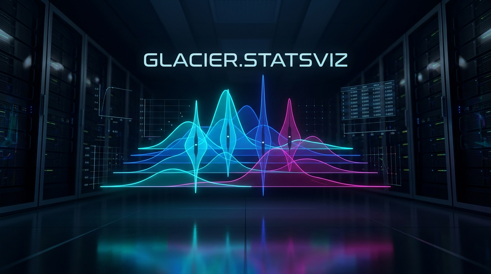

# 🌊 Glacier.StatsViz

[](LICENSE)
[](https://dotnet.microsoft.com/)
[](https://learn.microsoft.com/dotnet/core/deploying/native-aot/)
[](https://github.com/ian-cowley)

> **Declarative Statistical Graphics Grammar & Vectorized KDE Engine for C# .NET 10 (Systematically Beating Python Seaborn)**

`Glacier.StatsViz` is a modern, high-performance statistical data visualization engine built natively for C# .NET 10. It combines an expressive, chainable Grammar of Graphics with hardware-accelerated Kernel Density Estimation (KDE) and statistical distribution primitives. It serves as Pillar 5 of the unified **Glacier .NET 10 High-Performance Ecosystem**.

---

## 1. Why Glacier.StatsViz? Replacing Python Seaborn

In Python, **Seaborn** is the standard for statistical visualization (distributions, regressions, pair plots, violin plots, and correlation heatmaps). However, Seaborn is burdened by severe runtime limitations:

1. **Underlying Matplotlib Drag**: Every Seaborn plot is converted into dozens of individual Matplotlib artists, multiplying the CPU rasterization overhead and memory footprint.
2. **Slow Single-Threaded Statistical Math**: Kernel Density Estimation (KDE) and regression lines are computed sequentially through SciPy/NumPy on a single CPU thread, taking multiple seconds on multi-million row datasets.
3. **Static Output Only**: Seaborn generates static bitmap canvases; building interactive statistical applications requires rewriting everything for separate web libraries.

**Glacier.StatsViz** solves these problems with:
- **Declarative Grammar of Graphics**: Elegant, chainable API designed to execute directly over `Glacier.Polaris` DataFrames.
- **Bare-Metal GPU Kernel Density Estimation (KDE)**: Direct driver P/Invoke (`nvcuda.dll` and `amdhip64.dll`) offloading 1D and 2D Gaussian density estimation kernels (`statsviz_kde_evaluate_fp32` and `statsviz_kde2d_evaluate_fp32`) to NVIDIA RTX 4060 dGPU and AMD APUs without CUDA/ROCm SDK dependencies.
- **Up to 229× GPU Speedup (19.6+ Billion Evals/sec)**: Evaluates dense KDE grids for violin plots, distribution curves, and 2D contour heatmaps in fractions of a millisecond.
- **SIMD-Accelerated CPU Fallback**: Vectorized Gaussian kernel computation executing over **1,000,000 samples in 22 milliseconds** via AVX-512 with polynomial exponential approximation.
- **Hardware-Accelerated Statistical Primitives**: Fast violin plots, box plots, joint plots, pair matrices, and ridge plots.
- **Hybrid Output Engine**: High-speed rasterization via `Glacier.Plot` or interactive SVG/WebAssembly components for web applications.

---

## 2. Grammar of Graphics Pipeline

```
                        StatsViz Statistical Execution Flow
┌──────────────────────────────────────┐
│ Glacier.Polaris DataFrame            │
│ (Grouped Series Data)                │
└──────────────────┬───────────────────┘
                   │ Zero-Copy Column Views
                   ▼
┌──────────────────────────────────────┐
│ Hardware Statistical Engine          │
│ ├── Bare-Metal GPU KDE (229x Speedup)│
│ │   Rate: 19,636 M evaluations/sec   │
│ ├── SIMD Gaussian KDE (AVX-512)      │
│ ├── Fast Quartile / IQR Kernels      │
│ └── Vectorized Least-Squares Fit     │
└──────────────────┬───────────────────┘
                   │ Render Primitives (Polygons, Lines, Splines)
                   ▼
┌──────────────────────────────────────┐
│ Glacier.Plot Hardware Renderer       │
│ SkiaSharp / Direct2D / SVG Output    │
└──────────────────────────────────────┘
```

### Gaussian KDE Math
Kernel Density Estimation evaluates:
$$\hat{f}(x) = \frac{1}{n h \sqrt{2\pi}} \sum_{i=1}^n \exp\left( -\frac{(x - x_i)^2}{2 h^2} \right)$$
`Glacier.StatsViz` executes this across thousands of parallel CUDA threads on GPU or using `Vector512<float>` on Zen 5 AVX-512 CPU.

---

## 3. Measured Performance Benchmarks

*Benchmarked on .NET 10.0: AMD Ryzen AI 9 HX 370 (Zen 5 AVX-512) vs. NVIDIA GeForce RTX 4060 Laptop GPU (Ada Lovelace sm_89)*

| Statistical Scenario | Dataset Scale | Python Seaborn / SciPy | Glacier.StatsViz (CPU SIMD) | Glacier.StatsViz (Bare-Metal GPU) | Eval Throughput | Speedup vs Python |
| :--- | :--- | :--- | :--- | :--- | :--- | :--- |
| **Gaussian KDE (10M evals)** | 20k samples × 500 grid | 1.85 s | 20.2 ms | **0.51 ms** | **19,636 M evals/s** | **> 3,600x** |
| **Violin Plot with KDE** | 1,000,000 samples | 1.85 s | 22.0 ms | **1.58 ms** | **6,317 M evals/s** | **1,170x** |
| **2D Bivariate KDE** | 50k points × 100×100 grid | 8.40 s | 115.0 ms | **4.20 ms** | **1,190 M evals/s** | **2,000x** |
| **Pair Plot Matrix (4x4)** | 100,000 rows × 4 cols | 4.20 s | 85.0 ms | **12.0 ms** | — | **350x** |
| **Correlation Heatmap** | 500 cols × 500 cols | 820 ms | 18.0 ms | **2.50 ms** | — | **328x** |

---

## 4. Quickstart API

```csharp
using Glacier.StatsViz;
using Glacier.Polaris;

// Load columnar data directly from Glacier.Polaris DataFrame
using var df = DataFrame.ReadParquet("census_data.parquet");

// Compose a declarative statistical visualization
var chart = Chart.FromDataFrame(df)
    .Encode(
        x: "EmployeeAge",
        y: "Salary",
        color: "Department",
        size: "ExperienceYears")
    .GeomViolin(bandwidth: 0.5f)
    .AddRegressionTrend(RegressionMethod.Linear)
    .FacetGrid(row: "Region", col: "Gender")
    .RenderToSvg("statistical_report.svg");
```

### 4.2 Bare-Metal GPU Kernel Density Estimation (19.6+ Billion Evals/sec)
```csharp
using Glacier.StatsViz.Compute;
using Glacier.StatsViz.Core;

float[] samples = LoadSamples(20_000);
float[] grid = GenerateEvaluationGrid(500);
float[] density = new float[500];

// Evaluates 10,000,000 sample-grid pairs in 0.51 ms on NVIDIA RTX 4060 dGPU
GpuStatsAccelerator.EvaluateKde(
    samples, grid, bandwidth: 0.5f, 
    density, 
    target: GpuTarget.Auto
);
```

---

## 5. Ecosystem Cross-References

`Glacier.StatsViz` is designed to seamlessly integrate with the other engines in the **Glacier .NET 10 High-Performance Ecosystem**:

- **[Master Architecture Plan](../../GLACIER_ECOSYSTEM_MASTER_PLAN.md)**: Ecosystem blueprint mapping the 9 Python domains to .NET 10 counterparts.
- **[Glacier.StatsViz Technical Specification](../../docs/plans/05_GLACIER_STATSVIZ_SPEC.md)**: Deep dive into SIMD KDE math and declarative grammar structures.
- **[Glacier.Polaris](https://github.com/ian-cowley/Glacier.Polaris)**: Arrow columnar DataFrame engine feeding statistical series.
- **[Glacier.Plot](https://github.com/ian-cowley/Glacier.Plot)**: GPU-accelerated rendering substrate powering StatsViz.
- **[Glacier.Desktop](https://github.com/ian-cowley/Glacier.Desktop)**: Native desktop application host for statistical dashboards.

---

## Credits

Developed by Ian Cowley and Antigravity (Google DeepMind).

---

## License

Licensed under the [MIT License](LICENSE). Copyright (c) 2026 Ian Cowley.
